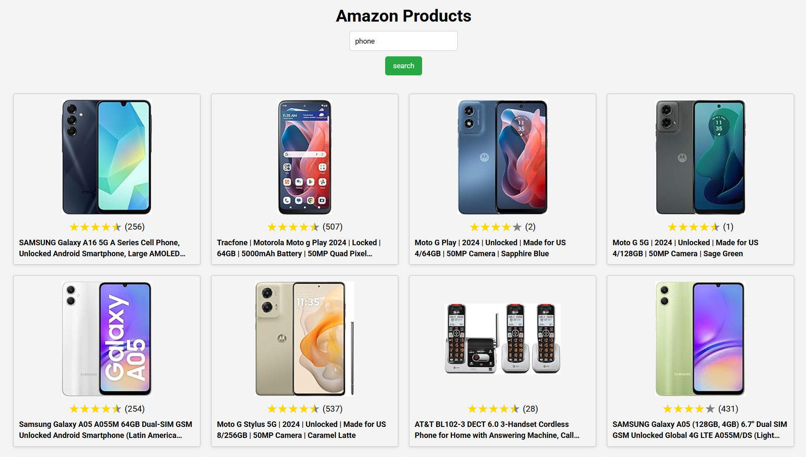

# 🛒 Amazon Scraper

A simple API that scrapes data from an Amazon search page and a frontend to search and view the extracted data.

## 🚀 Preview



## 📌 Features

- 🔍 Scrapes product data from Amazon search results  
- ⚡ Fast and lightweight backend powered by [Bun](https://bun.sh/)  
- 🎨 Simple and intuitive frontend built with [Vite](https://vite.dev/)  

## 📦 Requirements

Ensure you have the following installed before running the project:

- [Bun](https://bun.sh/) (for the backend)  
- [Node.js](https://nodejs.org/en/download) & [npm](https://nodejs.org/en/download) (for the frontend)  

## 🛠️ Setup & Running

Follow these steps to get the project running locally:

### 1️⃣ Backend Setup (Server)

Navigate to the `server` folder and install dependencies:

```bash
bun install
```

Start the backend server:

```bash
bun run start
```

### 2️⃣ Frontend Setup (Client)

Navigate to the `client` folder and install dependencies:

```bash
npm install
```

Start the frontend:

```bash
npm run dev
```

### 3️⃣ Open the App

Once everything is running, open [http://localhost:5173](http://localhost:5173) in your browser.
